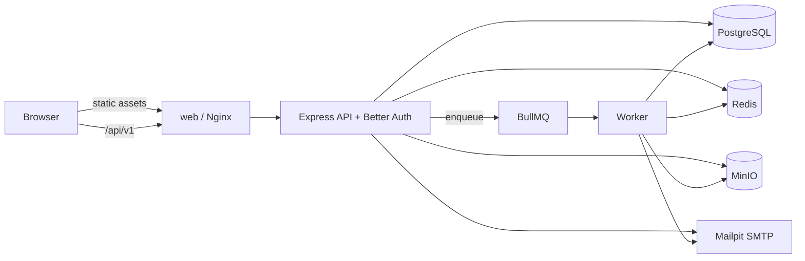

# Kōsa TODO

A collaborative TODO board application designed from the supplied [Figma file](https://www.figma.com/design/JxPLX0m5zrEJORwABJUyAp/Assesment---Sleekflow?node-id=0-1&p=f&t=IpEmKzygdgN2jYxJ-0).

> **Project status:** architecture and delivery conventions are defined; application scaffolding has not started yet. Commands and directory layouts marked **target** describe the next implementation phase.

## Product scope

### MVP

- Sign up and log in with email, password, display name, and a locally generated avatar.
- List the boards the current user belongs to.
- Show a board as a Kanban view with `Not Started`, `In Progress`, and `Completed` columns.
- Keep `Archived` tasks hidden unless explicitly shown.
- Search tasks and filter/sort by assignee, priority, status, and due date.
- Create, read, update, archive, and delete tasks.
- Task fields:
  - name and Markdown description;
  - file/image attachments;
  - due date;
  - optional recurring schedule;
  - status and priority;
  - assignee and reporter;
  - dependencies on other tasks in the same board.
- List board members and invite a member by email with an assigned role.
- Run the complete application locally with Docker Compose.
- Publish an OpenAPI document and interactive API documentation.

### Explicitly deferred

The Figma file also contains controls for favorites, tags, projects, “My Tasks”, archive pages, roster export, audit logs, keyboard shortcuts, and sync indicators. These may be rendered to preserve the composition but do not need behavior in the first release. Board creation can initially use seed data; making the “Create Board” UI functional is a later slice.

Email invites are functional in local development through Mailpit; delivering public email is an environment/deployment concern. Real-time multi-user updates, comments, notifications, malware scanning, and external identity providers are also deferred.

## Design source of truth

The desktop Figma frames are:

| Screen | Figma node |
| --- | --- |
| Sign up / login | `1:2` |
| All boards | `1:838` |
| Task board | `1:128` |
| New task modal | `1:1045` |
| Edit task modal | `1:479` |
| Board settings / members | `1:1531` |

Implementation should preserve the warm editorial visual language while remaining responsive and accessible:

- Background `#faf8f5`, primary ink `#1a1918`, border `#e8e4de`, and muted text around `#5c5750` / `#87827b`.
- `Newsreader` for editorial headings, `Plus Jakarta Sans` for UI/body text, and `Space Mono` for compact metadata. Fonts will be bundled with `@fontsource` rather than fetched at runtime.
- Airy spacing, hairline borders, subtle status tints, restrained shadows, and 8–16 px radii.
- The Figma file only defines desktop screens. On narrow screens controls stack, board columns remain horizontally scrollable, and task dialogs become full-screen sheets.

The requested domain vocabulary overrides prototype copy. In particular, statuses are exactly `NOT_STARTED`, `IN_PROGRESS`, `COMPLETED`, and `ARCHIVED`, even where a prototype control says “Todo”, “Done”, or “Canceled”.

Before implementing a screen, retrieve that exact node through the Figma MCP, request design context plus a screenshot, and compare the finished browser output against it. Do not copy Figma-generated absolute-positioned code directly into the application.

## Architecture decisions

| Area | Decision | Rationale |
| --- | --- | --- |
| Architecture | TypeScript modular monolith with a separate web client and worker process | Keeps one deployable backend/codebase while allowing background jobs to scale independently. Microservices are unnecessary for this scope. |
| Repository | `pnpm` workspace, pinned through Corepack; no task orchestrator initially | Shared contracts and database code without adding Turborepo complexity before it is needed. |
| Web | React + Vite + React Router | Matches the requested stack and supports a simple SPA deployment. |
| Styling | Sass (`.scss`) with CSS Modules and global CSS custom-property tokens | Meets the Sass preference, prevents global leakage, and supports a bespoke Figma implementation without a utility CSS framework. |
| Server state | TanStack Query | Cache, mutation, retry, and invalidation behavior without duplicating API data in a global store. |
| Forms | React Hook Form + shared Zod schemas | Accessible forms with one validation contract shared with the API. |
| UI primitives | Radix UI primitives + Lucide icons, styled locally | Accessible behavior without imposing a visual system that conflicts with Figma. |
| Drag and drop | `dnd-kit` only when status drag/drop is implemented | Accessible, React-friendly, and avoids a dependency before the interaction is required. |
| API | Express REST under `/api/v1` | Straightforward resource model, easy local operation, and good OpenAPI support. GraphQL is not justified. |
| Contracts/docs | Zod DTOs in a shared package; OpenAPI 3.1 generated from them; Swagger UI at `/api/docs` | Runtime validation, inferred frontend types, and documentation cannot silently drift apart. |
| Database | PostgreSQL + Prisma ORM and committed SQL migrations | Strong fit for memberships, dependencies, and transactions; Prisma offers clear schema/migration ergonomics. Raw SQL migrations remain available for PostgreSQL indexes/extensions. |
| Authentication | Better Auth mounted in Express, using its Prisma adapter, opaque cookie sessions, and custom Argon2id password hashing | Provides credential auth now and a supported path to OAuth/OIDC providers and account linking later, without adding another deployed service or storing JWTs in the browser. |
| Cache/queues | Redis for Better Auth secondary storage, rate limits, BullMQ jobs, and bounded read-through caches | Gives Redis concrete responsibilities while PostgreSQL remains the durable source of truth. |
| Attachments | S3-compatible object storage; MinIO in local Compose | Keeps blobs out of PostgreSQL and makes local behavior match a common production storage contract. |
| Email | Nodemailer over SMTP; Mailpit in local Compose | Invitations can be exercised locally without an external vendor. |
| Recurrence | RFC 5545 RRULE + IANA timezone, expanded by an idempotent BullMQ worker | Avoids inventing a recurrence format and handles daylight-saving behavior explicitly. |
| Tests | Vitest everywhere, Supertest for API HTTP tests, Testing Library + MSW for React, Playwright for critical journeys | One fast unit-test runner plus focused integration and browser coverage. |
| Observability | Pino structured logs, request IDs, `/health/live`, and dependency-aware `/health/ready` | Useful Docker diagnostics without introducing a full telemetry stack. |

### System context



In development, Vite proxies `/api` to Express. In the Docker deployment, Nginx serves the compiled SPA and proxies `/api`, so browser cookies stay same-origin and CORS is not required for the default setup.

## Target repository layout

```text
.
├── apps/
│   ├── api/                    # Express API and worker entry points
│   │   ├── prisma/             # schema and committed migrations
│   │   └── src/
│   │       ├── modules/        # users, boards, tasks, invitations, attachments
│   │       ├── auth/           # Better Auth config, adapters, callbacks, policies
│   │       ├── infrastructure/ # db, redis, object storage, mail, queues
│   │       ├── app.ts          # app factory; no network side effects
│   │       ├── server.ts       # HTTP process entry point
│   │       └── worker.ts       # background process entry point
│   └── web/                    # React/Vite SPA
│       └── src/
│           ├── app/            # router, providers, application shell
│           ├── features/       # auth, boards, tasks, board-members
│           ├── components/     # reusable UI components
│           └── styles/         # tokens, reset, mixins, global styles
├── packages/
│   ├── contracts/              # Zod request/response schemas and inferred types
│   └── config/                 # shared TypeScript/lint configuration
├── docker/                     # Dockerfiles and Nginx config
├── compose.yaml
├── pnpm-workspace.yaml
├── AGENTS.md
└── .pi/skills/                 # project workflow skill for future agents
```

The API is a modular monolith. A module owns its HTTP routes, service/application logic, repository access, and tests. Route handlers parse input and map responses; business and authorization rules live in services; repositories contain database queries. Modules may interact through explicit service interfaces, not by importing another module’s internal repository.

## Domain and persistence model

All IDs are UUIDv7 values. Timestamps are stored in UTC and serialized as ISO 8601. Recurrence retains the user-selected IANA timezone.

### Core records

- **User** — Better Auth’s user record, with case-insensitive email, display name, generated-avatar seed, verification state, and timestamps.
- **Account** — Better Auth credential or social-provider identity. Provider identities are unique by provider plus provider account ID; credential passwords use the configured Argon2id hash/verify functions.
- **Session** and **Verification** — Better Auth-managed session and one-time verification records. Redis may act as Better Auth secondary storage/cache, while durable auth records remain in PostgreSQL.
- **Board** — name, description, owner, timestamps, and optimistic concurrency version.
- **BoardMembership** — board, user, role (`ADMIN`, `MANAGER`, `CONTRIBUTOR`), joined timestamp; unique per board/user.
- **BoardInvitation** — board, normalized email, role, token hash, inviter, expiry, accepted/revoked timestamps. Plain invite tokens are never persisted.
- **Task** — board, human-friendly board sequence number, name, Markdown description, status, priority, due date, assignee, reporter, creator, version, timestamps, and optional soft-deletion timestamp.
- **TaskDependency** — directed `task -> dependsOnTask` edge, unique per pair.
- **Attachment** — task, uploader, object key, original filename, media type, byte size, checksum, timestamps.
- **TaskSchedule** — template task, RRULE, timezone, start/end values, next run, enabled flag.
- **ScheduleOccurrence** — schedule, scheduled instant, generated task; unique on schedule + instant for idempotency.

### Invariants

- A task, its assignee, reporter, and every dependency belong to the same board.
- A task cannot depend on itself and dependency cycles are rejected in a transaction.
- Reporter defaults to the current user. Contributors can select themselves; managers/admins can select another board member.
- Only active board members can read board data. Contributors manage tasks; managers/admins manage membership and invitations; only admins perform destructive board operations.
- `ARCHIVED` is a task state and is excluded from list queries by default. Deletion is a separate, explicit operation.
- Task updates include a `version`; stale updates return `409 Conflict` rather than silently overwriting another edit.
- Recurrence edits affect future generated occurrences. Existing occurrences remain historical records.
- The worker records each scheduled instant before/while generating its task so retries cannot create duplicates.
- Attachments are deleted asynchronously after their database record/task is removed.

Prisma migrations are the only way to change shared schemas. `prisma db push` is not used outside disposable experiments. PostgreSQL’s `citext` and `pg_trgm` extensions may be enabled by migration for normalized email and task search.

## API conventions

- Base path: `/api/v1`.
- JSON uses camelCase; enum values use the uppercase values shown above.
- Request and response bodies are validated by shared Zod contracts.
- Errors use `application/problem+json` following RFC 9457 and include a stable machine-readable `code` and request ID.
- Collection endpoints use cursor pagination. Task-board queries may request a sufficiently high bounded page size for each column; no unbounded query is allowed.
- Search/filter/sort state is represented in query parameters so a board view is linkable.
- Mutations requiring concurrency protection send the current `version` in the body or `If-Match` header.
- OpenAPI JSON: `/api/docs/openapi.json`; interactive documentation: `/api/docs`.

Planned resource surface:

```text
ALL    /auth/*                         # Better Auth handler
       # email signup/sign-in, sign-out, session, and future OAuth callbacks

GET    /boards
GET    /boards/:boardId
GET    /boards/:boardId/members
POST   /boards/:boardId/invitations
GET    /invitations/:token
POST   /invitations/:token/accept

GET    /boards/:boardId/tasks
POST   /boards/:boardId/tasks
GET    /tasks/:taskId
PATCH  /tasks/:taskId
DELETE /tasks/:taskId
POST   /tasks/:taskId/attachments
DELETE /tasks/:taskId/attachments/:attachmentId
```

The Better Auth handler is mounted at `/api/v1/auth`. Its route contracts and generated reference are owned by the pinned Better Auth version; the application OpenAPI document covers the remaining endpoints and links to the auth reference. Task creation/update contracts include dependency IDs and optional schedule details. Services perform authorization independently of what the UI hides.

## Authentication and security baseline

- Mount Better Auth inside the Express API; it is a library, not another Compose service. Pin its version and review release notes for schema, cookie, and account-linking changes.
- Use the Better Auth Prisma adapter and commit its required tables through the same Prisma migration workflow as application tables.
- Configure Better Auth email/password hashing and verification callbacks with Argon2id using OWASP-aligned parameters. Enforce at least 12 characters and allow password-manager-friendly long values.
- Normalize and compare email addresses case-insensitively without changing display names.
- Use Better Auth’s opaque, revocable session cookies. Cookie defaults are `HttpOnly`, `SameSite=Lax`, `Path=/`, and `Secure` outside local HTTP development; auth tokens never enter `localStorage`.
- Set `BETTER_AUTH_SECRET` from a high-entropy deployment secret and configure the public `BETTER_AUTH_URL`, trusted origins, and Express proxy handling explicitly.
- Use Better Auth’s origin/CSRF protections for auth routes and retain application CSRF/origin protection for other state-changing endpoints. Rate-limit signup/login/invite endpoints through Redis.
- Return the same login failure for unknown users and bad passwords.
- Validate authorization at the service/repository boundary for every board-scoped access to prevent IDOR vulnerabilities.
- Validate attachment size, detected/allowed media type, and filename separately. Generate object keys server-side, never execute uploads, and force unsafe types to download.
- Default limits: 10 MiB per file and 50 MiB total per task, configurable by environment.
- Validate environment variables at process startup and never commit secrets or production-like credentials.
- Sanitize rendered Markdown and disallow raw HTML.

The avatar is generated deterministically from a random seed using a bundled DiceBear style. Only the seed is stored, so signup does not rely on an external avatar service.

Better Auth proves identity; application services still own board/task authorization. Future social login uses Better Auth provider accounts and the authorization-code flow. Provider identity is keyed by provider plus provider account ID, never email alone. Automatic linking based only on matching email is disabled; linking requires an authenticated user or verified proof of control according to an explicit policy. A user may retain both credential and social login methods.

## Frontend architecture

- **Routing:** public auth route; protected boards, board, and board-settings routes; route guards resolve the Better Auth client session before rendering protected content.
- **State:** the Better Auth React client owns identity/session state. TanStack Query owns application server state, URL search parameters own board filters/sort/search, React Hook Form owns forms, and component state owns ephemeral UI. Add a global client store only if a concrete cross-route use case appears.
- **Contracts:** Better Auth’s client consumes its auth routes. A separate thin fetch client consumes application types/schemas from `packages/contracts`, sends cookies, translates Problem Details, and supports request cancellation.
- **Accessibility:** semantic controls, visible focus, labels and errors, focus-trapped/restored dialogs, keyboard-operable menus, reduced-motion support, and non-color status labels. Drag/drop must have a keyboard alternative.
- **Loading/error states:** each route and mutation supplies deliberate loading, empty, error, and retry states; optimistic updates must roll back on failure.

### Sass conventions

- Component styles use `ComponentName.module.scss`; global styles are limited to reset, fonts, root tokens, and application-level defaults.
- Sass modules use `@use`, never deprecated `@import`.
- Design primitives are CSS custom properties declared in `styles/_tokens.scss`, allowing runtime theming and readable browser inspection. Sass variables/mixins may generate consistent scales but must not hide component semantics.
- Use logical properties and mobile-first media queries. Avoid inline style objects except for truly data-driven values such as a calculated avatar color.
- Do not introduce Tailwind, CSS-in-JS, or another component theme without recording a new architecture decision.
- Prefer composition over deep selector nesting; cap nesting at roughly three levels and do not style via generated DOM internals when a primitive exposes a class/part.

## Redis policy

PostgreSQL is authoritative. Redis is used for:

1. Better Auth secondary session storage/cache and auth metadata, according to the pinned version’s supported adapter contract;
2. login/invite rate-limit counters;
3. BullMQ queues and idempotent background work;
4. short-lived board-list/board-summary caches (target TTL 30–60 seconds).

Task-board data is not cached initially because its high mutation rate makes invalidation more complex than the likely gain. Membership and board mutations explicitly invalidate affected user/board cache keys. Cache failures degrade reads to PostgreSQL where safe; they never bypass authorization.

## Local deployment (**target**)

The Compose project will contain:

| Service | Purpose |
| --- | --- |
| `web` | Nginx serving the Vite build and proxying `/api` |
| `api` | Express HTTP process |
| `worker` | Same backend image, BullMQ worker command |
| `migrate` | One-shot production migration job |
| `postgres` | Persistent relational data |
| `redis` | Better Auth secondary storage, queues, limits, and caches |
| `minio` | S3-compatible attachment storage |
| `mailpit` | Local SMTP inbox and browser UI |

Planned first-run command:

```bash
docker compose up --build
```

Expected local endpoints after scaffolding:

- Application: `http://localhost:8080`
- API docs: `http://localhost:8080/api/docs`
- Mailpit: `http://localhost:8025`
- MinIO console: `http://localhost:9001`

Compose health checks and `depends_on: condition: service_healthy` will gate startup. Named volumes persist PostgreSQL, Redis, and MinIO data. The migration job must succeed before API/worker startup. Images run as non-root users and receive configuration through environment variables. Better Auth runs in `api`; local OAuth callbacks use the public URL (for example `http://localhost:8080/api/v1/auth/callback/...`), never an internal Compose hostname. Social providers remain disabled when their client credentials are absent.

## Testing strategy

- **Unit:** domain rules, recurrence calculations, authorization decisions, validators, cache-key/invalidation logic, and React components.
- **API integration:** Express app factory + Supertest against isolated PostgreSQL/Redis/MinIO test dependencies; test Better Auth credential/session flows and both allowed and forbidden application paths. Social-provider tests use mocked provider responses.
- **Contract:** generated application OpenAPI snapshot, Better Auth route-reference availability, and representative request/response schemas.
- **Browser:** Playwright journeys for signup/login, board listing, task CRUD/filter/archive, attachment upload, and member invitation acceptance.
- **Visual:** compare implemented screens at the Figma desktop dimensions and selected responsive widths. Screenshot tests support review but do not replace semantic assertions.

Tests must control time and timezone for due-date/recurrence behavior. Each bug fix adds a regression test at the lowest useful level.

## Quality gates and CI plan

Every change should pass the workspace equivalents of:

```bash
pnpm format:check
pnpm lint
pnpm typecheck
pnpm test
pnpm build
```

A later GitHub Actions workflow will run those checks, start service containers for integration tests, run migrations, and build (but not publish) Docker images. Playwright can be a separate job after the core checks. Dependency caching must key from `pnpm-lock.yaml`.

Coverage is used to find gaps, not as a substitute for behavior-based tests. Initial targets are 80% for domain/service modules and meaningful coverage for critical UI journeys.

## Delivery plan

1. **Workspace foundation** — pnpm workspace, TypeScript, lint/format, environment validation, Compose dependencies, health endpoints.
2. **Identity** — Better Auth/Prisma schema, Argon2id callbacks, signup/sign-in/sign-out/session flows, Redis secondary storage, generated avatars, and auth UI; leave provider configuration ready for later social login.
3. **Boards and membership** — board list/detail, seeded board, member list, invitations, Mailpit flow, authorization.
4. **Task core** — CRUD, status/priority, assignee/reporter, due dates, search/filter/sort/archive, optimistic concurrency.
5. **Task detail** — Markdown editor/rendering, dependencies with cycle checks, MinIO attachments.
6. **Recurring work** — RRULE editor, queue/worker generation, idempotency and timezone tests.
7. **Design hardening** — responsive behavior, accessibility audit, Figma comparison, loading/empty/error states.
8. **Delivery hardening** — full Compose path, OpenAPI review, Playwright, CI workflow, operational documentation.

Slices should stay vertically deployable: schema + contract + API + UI + tests in the same change where practical.

## Decision boundaries

These choices are accepted defaults for implementation, not irreversible constraints. Change one only with a short decision note in this README (choice, reason, consequences), updated agent guidance, and relevant migration/deployment notes. In particular, do not casually replace Sass Modules, Prisma, Better Auth, REST/OpenAPI, or MinIO midway through a feature.

## Agent guidance

Repository-wide rules live in [`AGENTS.md`](AGENTS.md). Pi also discovers the project workflow skill at [`.pi/skills/todo-app-workflow/SKILL.md`](.pi/skills/todo-app-workflow/SKILL.md). Future agents should read both before changing code.
