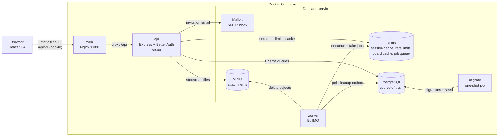

# Ksat — collaborative TODO boards

Ksat is a TODO list web application built for the SleekFlow Software Engineer assessment. Users manage TODOs on shared boards through a REST API and a React web UI.

- **Decision log:** [`Decision Log - Valentin Van - Sleekflow’s Technical Assessment.pdf`](<Decision Log - Valentin Van - Sleekflow’s Technical Assessment.pdf>)
- **API documentation:** Swagger UI at [http://localhost:8080/api/docs](http://localhost:8080/api/docs) (OpenAPI 3.1 JSON at `/api/docs/openapi.json`)

## Running locally

### Prerequisites

- Docker with Docker Compose
- For development without containers: Node.js `24.12.0` and Corepack (pnpm `11.18.0` is pinned)

### Quick start (Docker)

```bash
cp .env.example .env
docker compose up --build
```

The `migrate` job applies migrations and loads demo data before the API starts.

| Service | URL |
| --- | --- |
| Web application | http://localhost:8080 |
| API documentation (Swagger) | http://localhost:8080/api/docs |
| Mailpit (invitation emails) | http://localhost:8025 |
| MinIO console | http://localhost:9001 |
| API health | http://localhost:3000/health/ready |

**Demo accounts** (password `ksat-demo-password-2027`): `ada@example.test`, `grace@example.test`, `linus@example.test`, `maya@example.test`. These are fake, local-only credentials.

### Development mode (hot reload)

```bash
corepack enable
pnpm install --frozen-lockfile
cp apps/api/.env.example apps/api/.env
pnpm dev:infra     # PostgreSQL, Redis, MinIO and Mailpit in Docker
pnpm db:migrate
pnpm db:seed
pnpm dev           # API on :3000, web on http://localhost:5173
```

Stop the Compose `api`, `web` and `worker` containers first if they are running, so port 3000 is free.

### Large dataset

```bash
pnpm db:seed:volume            # 200 users, 21 boards, 15,000 tasks (10,000 on one board)
pnpm db:seed:volume -- --help  # size options
```

Sign in as `volume.user.0001@example.test` with the demo password. With Docker, run `docker compose run --rm migrate node dist/src/seed-volume.js`.

### Inspecting the database

Browse the data with Prisma Studio at http://localhost:5555:

```bash
pnpm --filter @ksat/api exec prisma studio --schema prisma/schema.prisma
```

It reads `DATABASE_URL` from `apps/api/.env`. With the Docker quick start, run `pnpm install` and copy `apps/api/.env.example` to `apps/api/.env` first.

For SQL (for example `EXPLAIN ANALYZE` to check index usage), connect any PostgreSQL client such as DBeaver or TablePlus to `localhost:5432`, database `ksat`, user `postgres`, password `postgres`. These are the local defaults from `.env.example`.

### Recovering a deleted task

There is no user-facing trash. An operator can restore a soft-deleted task:

```bash
pnpm --filter @ksat/api task:restore -- <task-uuid>
```

## Architecture

> **Detailed diagrams:** [docs/architecture.md](docs/architecture.md) covers the request pipeline, code organization, database, authentication, invitations, task lifecycle, task updates, recurring tasks, attachments and frontend data flow.

Arrows point from the component that initiates each call.


```mermaid
flowchart LR
  B["Browser<br/>React SPA"]

  subgraph Compose["Docker Compose"]
    W["web<br/>Nginx :8080"]
    A["api<br/>Express + Better Auth<br/>:3000"]

    subgraph Data["Data and services"]
      direction TB
      M["Mailpit<br/>SMTP inbox"]
      O[("MinIO<br/>attachments")]
      R[("Redis<br/>session cache, rate limits,<br/>board cache, job queue")]
      P[("PostgreSQL<br/>source of truth")]
    end

    K["worker<br/>BullMQ"]
    MG["migrate<br/>one-shot job"]
  end

  B -->|"static files +<br/>/api/v1 (cookie)"| W
  W -->|proxy /api| A
  A -->|invitation email| M
  A -->|store/read files| O
  A -->|sessions, limits, cache| R
  A -->|Prisma queries| P
  O ~~~ K
  R ~~~ K
  P ~~~ K
  K -->|delete objects| O
  K -->|enqueue + take jobs| R
  K -->|poll cleanup outbox| P
  P ~~~ MG
  MG -->|migrations + seed| P
```

- **API:** TypeScript modular monolith (Express). Each module owns its routes, services (business rules and authorization) and repositories (database access).
- **Web:** React + Vite SPA with TanStack Query, React Hook Form, Radix primitives and Sass modules.
- **Contracts:** shared Zod schemas validate requests/responses and generate the OpenAPI document.
- **Data:** PostgreSQL (Prisma with committed migrations) is the source of truth. Redis holds the session cache, rate limits and queues; MinIO stores attachments.
- **Worker:** processes attachment object cleanup in the background.

The rationale and trade-offs are in the decision log.

### Repository layout

```text
.
├── apps/
│   ├── api/                      # Express API and background worker
│   │   ├── prisma/               # Prisma schema and committed SQL migrations
│   │   ├── scripts/              # Migration drift check
│   │   ├── src/
│   │   │   ├── auth/             # Better Auth setup, Argon2id hashing, sessions
│   │   │   ├── config/           # Validated environment variables
│   │   │   ├── infrastructure/   # PostgreSQL, Redis, S3/MinIO, SMTP, queues
│   │   │   ├── modules/          # boards, invitations, tasks, attachments
│   │   │   │   └── tasks/        # service (rules), repository (queries), recurrence
│   │   │   ├── app.ts            # Express app factory
│   │   │   ├── routes.ts         # HTTP routes → services
│   │   │   ├── openapi.ts        # OpenAPI document generated from contracts
│   │   │   ├── server.ts         # API entry point
│   │   │   ├── worker.ts         # Worker entry point (attachment cleanup)
│   │   │   ├── seed.ts           # Demo data
│   │   │   ├── seed-volume.ts    # Large dataset (10,000+ tasks)
│   │   │   └── task-restore.ts   # Restore a soft-deleted task
│   │   └── tests/                # Unit, HTTP and PostgreSQL integration tests
│   └── web/                      # React + Vite SPA
│       └── src/
│           ├── app/              # Router, session guard, application shell
│           ├── features/         # auth, boards, invitations, tasks
│           ├── components/       # Shared UI: AppShell, Avatar, Select, Toast…
│           ├── lib/api/          # Typed fetch client and TanStack Query hooks
│           ├── styles/           # Sass tokens, mixins, global styles
│           └── assets/           # Bundled icons and images
├── packages/
│   ├── contracts/                # Shared Zod schemas (API ↔ web ↔ OpenAPI)
│   └── config/                   # Shared TypeScript configuration
├── e2e/                          # Playwright journeys and accessibility checks
├── docker/                       # API/web Dockerfiles and Nginx config
├── .github/workflows/ci.yml      # CI: quality, database, browser jobs
├── compose.yaml                  # Local stack
└── AGENTS.md                     # Rules for contributors and coding agents
```

## Features

### Core requirements

| Requirement | Implementation |
| --- | --- |
| TODO fields | UUIDv7 ID, name, Markdown description, due date, status (`NOT_STARTED`, `IN_PROGRESS`, `COMPLETED`, `ARCHIVED`), priority (`LOW`, `MEDIUM`, `HIGH`), assignee, dependencies and attachments. |
| CRUD | Create, read, update and delete tasks from a Kanban board and task modal. |
| Recurring tasks | A calendar-style **Repeat** menu offers presets derived from the due date (daily, weekly on its weekday, monthly on its nth weekday, annually, every weekday) and a **Custom…** dialog for interval, weekdays, monthly pattern, end condition and IANA timezone. Rules are stored as RRULEs, but users never edit raw RRULE text. A recurring task requires a due date; completing it creates exactly one next occurrence with the next scheduled due date and hands the repeat schedule to that occurrence in the same transaction. Deleting an older occurrence, including the original task, therefore does not stop the series. Dates arriving on their own do not create tasks. |
| Dependencies | A task can depend on other tasks on the same board. It cannot enter `IN_PROGRESS` or `COMPLETED` until its prerequisites are settled; self-dependencies and cycles are rejected. |
| Filtering | Status, priority, due date (overdue, today, next 7 days, none), blocked/unblocked, assignee and name/number search. |
| Sorting | Tasks are grouped in status columns and sorted by due date, priority, name, newest or oldest. |
| Concurrent users | Boards have members. Every update carries a `version`; stale edits return `409 Conflict` and the UI offers to reload the latest task. |
| No permanent data loss | Deletion is a soft delete. Deleted tasks are hidden but retained and can be restored by an operator (see [Recovering a deleted task](#recovering-a-deleted-task)). Archiving is a separate, user-reversible status. |
| 10,000+ tasks | Server-side filtering, keyset pagination, database indexes and virtualized board columns. A volume seed creates a 10,000-task board for testing. |

### Additional features

- Email/password registration and login with cookie sessions.
- Boards with `ADMIN`, `MANAGER` and `CONTRIBUTOR` roles, and email invitations (delivered locally through Mailpit).
- File and image attachments stored in S3-compatible storage.
- Drag-and-drop between columns, with a keyboard-accessible alternative.
- URL-backed filters, so a board view can be reloaded or shared.
- Docker Compose setup, GitHub Actions CI and an architecture diagram.

## API

Interactive documentation: [http://localhost:8080/api/docs](http://localhost:8080/api/docs) (with the stack running). All endpoints are under `/api/v1`.

| Area | Endpoints |
| --- | --- |
| Authentication | `/auth/*` (Better Auth: `sign-up/email`, `sign-in/email`, `sign-out`, `get-session`) |
| Boards | `GET/POST /boards`, `GET/PATCH /boards/:boardId`, `GET /boards/:boardId/members` |
| Invitations | `GET/POST /boards/:boardId/invitations`, `DELETE /boards/:boardId/invitations/:invitationId`, `GET /invitations/:token`, `POST /invitations/:token/accept` |
| Tasks | `GET/POST /boards/:boardId/tasks`, `GET/PATCH/DELETE /tasks/:taskId` |
| Attachments | `GET/POST /tasks/:taskId/attachments`, `GET /tasks/:taskId/attachments/:attachmentId/content`, `DELETE /tasks/:taskId/attachments/:attachmentId` |

Conventions:

- **Authentication:** HttpOnly session cookie; unauthenticated requests return `401`.
- **Authorization:** only board members can access board data; other boards and tasks return `404`.
- **Validation and errors:** request bodies and queries are validated with Zod. Errors use RFC 9457 Problem Details with a stable `code` (for example `VALIDATION_ERROR`, `TASK_VERSION_CONFLICT`, `TASK_DEPENDENCIES_INCOMPLETE`).
- **Concurrency:** `PATCH` and `DELETE` require the current `version`; a stale version returns `409`.
- **Pagination:** cursor-based, up to 100 items per page.
- **Task list query:** `q`, `status`, `priority`, `due` + `today`, `blocking` (`BLOCKED`/`UNBLOCKED`), `assignee`, `includeArchived`, `sort` (`DUE_DATE`, `PRIORITY`, `NAME`, `NEWEST`, `OLDEST`).
- **Mutations** must come from a trusted origin (CSRF protection).

## Testing

```bash
pnpm test                                   # unit and component tests (no services required)
pnpm --filter @ksat/api test:integration    # PostgreSQL integration tests (requires pnpm dev:infra and migrations)
pnpm test:e2e:install && pnpm test:e2e      # Playwright journeys against http://localhost:5173
pnpm check                                  # format, lint, typecheck, test, build, Compose config
```

| Layer | Coverage |
| --- | --- |
| Contracts | Validation boundaries and normalization shared by API and web. |
| API | Business rules, authorization (`401`/`403`/`404`), version conflicts, dependency cycles and gating, recurrence (timezones, daylight saving, no duplicate occurrences), soft deletion and attachment validation. |
| Web | Loading, empty, error and retry states; form validation; optimistic updates and rollback; conflict recovery; keyboard interactions. |
| End to end | Sign-up, boards, task lifecycle, filters, dependencies, recurrence, attachments, invitations and accessibility (axe). |

CI (`.github/workflows/ci.yml`) runs the quality checks, database migrations and integration tests, and the Playwright journeys. The browser job builds and caches the pinned MinIO release from upstream source because its public image and binary downloads are unavailable. It verifies the attachment bucket, seeds the demo accounts used by the recurrence journey, and waits for API dependency readiness before testing. Startup logs are included in failure artifacts.

## AI-assisted development

This project was built with AI coding agents, directed and reviewed by me.

- **Rules for agents:** [`AGENTS.md`](AGENTS.md) defines the architecture boundaries, testing expectations, security rules and commit conventions every agent must follow. A project skill (`.pi/skills/todo-app-workflow/SKILL.md`) describes the delivery workflow.
- **Planned in slices:** each feature was planned and delivered as a vertical slice (contract → database → API → web → tests), with acceptance criteria written before implementation.
- **Independent review:** code written by one model family was reviewed by a different one to reduce shared blind spots.
- **Human decisions:** requirement interpretation, scope and trade-offs were decided by me; see the decision log.
- **Conversation log:** condensed excerpts of the agent sessions for each phase are in [`docs/ai-conversations/`](docs/ai-conversations/).
- **Verification:** AI-written code had to pass the same checks as any change (`pnpm check`, integration tests and Playwright journeys in CI).
