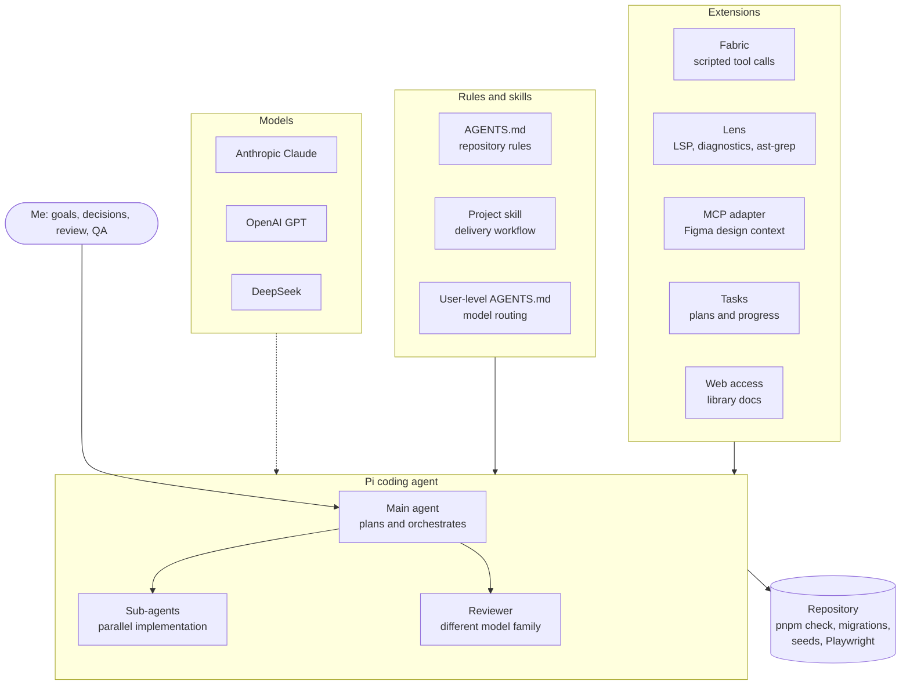
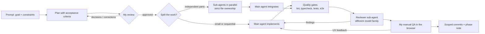

# AI conversation log

Curated excerpts of the AI coding-agent sessions (run in [Pi](https://github.com/badlogic/pi-mono)) used to build Ksat, grouped by delivery phase.

## How to read these files

- **Me:** my prompts, lightly edited for typos and length. Pasted logs and screenshots are replaced by a short description.
- **Agent:** a condensed summary of the agent's answer. Tool calls, intermediate progress messages and raw command output are omitted.
- Local paths, machine names, account names, IP addresses, tokens, cookies, IDs and design-file URLs are redacted or replaced with placeholders such as `<repo>`.
- Commit hashes are kept where they help trace a change in the Git history.

## Toolkit

- **Agent harness:** [Pi](https://github.com/badlogic/pi-mono), a terminal coding agent that works with models from several providers.
- **Models by role:** one model plans and orchestrates, others implement, and the reviewer always comes from a **different model family** than the implementer (Claude, GPT or DeepSeek).
- **Rules:**
  - The repository [`AGENTS.md`](../../AGENTS.md) holds the architecture, security, testing and commit rules that every agent follows.
  - A project skill (`.pi/skills/todo-app-workflow`) describes the delivery workflow step by step.
  - My personal model-routing preferences live in a user-level `AGENTS.md`, outside the repository.
- **Extensions:**
  - **Fabric** runs batched, type-checked tool scripts, so the agent can search, edit and test in one step.
  - **Sub-agents** run implementation in parallel or in isolated Git worktrees, and run reviewers.
  - **Lens** gives LSP navigation, diagnostics and structural (ast-grep) search.
  - **MCP adapter** connects to the Figma MCP server to get design context and screenshots.
  - **Tasks** tracks plans, acceptance criteria and evidence.
  - **Web access** looks up library documentation.
- **Scripts the agents rely on:** `pnpm check` (format, lint, typecheck, tests, build, Compose config), the migration drift guard, deterministic seeds, and the Playwright journeys.

## Working method

- Each phase starts with a **plan** that I review, correct and approve before implementation.
- Implementation is a vertical slice: shared contract → migration → API → web → tests → docs.
- **Sub-agents** handle work that splits cleanly, for example backend and frontend in separate worktrees, or planning specialists. Each owns its files so they never edit the same manifest or lockfile. The main agent integrates the result and runs the gates.
- A **reviewer sub-agent** from a different model family checks the diff, and its findings are fixed before commit.
- I test every slice in the browser and send UX feedback in follow-up prompts.

## Index

| File | Scope |
| --- | --- |
| [00-architecture.md](00-architecture.md) | Requirements, stack choices, agent rules |
| [01-workspace-foundation.md](01-workspace-foundation.md) | Monorepo, Docker Compose, health checks |
| [02-identity.md](02-identity.md) | Better Auth sign-up/sign-in, sessions |
| [03-boards-and-membership.md](03-boards-and-membership.md) | Boards, roles, invitations, re-planning |
| [04a-task-board.md](04a-task-board.md) | Kanban board, task CRUD, drag and drop, dev tooling |
| [04b-people-and-dates.md](04b-people-and-dates.md) | Assignee, due date, task modal |
| [04c-finding-work.md](04c-finding-work.md) | Search, filters, sorting, archive, test strategy |
| [05a-content-and-dependencies.md](05a-content-and-dependencies.md) | Markdown description, dependency rules |
| [05b-attachments.md](05b-attachments.md) | Private file attachments |
| [06-recurring-work.md](06-recurring-work.md) | Timezone-aware recurring tasks |
| [07-release-hardening.md](07-release-hardening.md) | UI clean-up, accessibility, OpenAPI |
| [08-scale-and-data-safety.md](08-scale-and-data-safety.md) | Soft delete, completion-triggered recurrence, 10k tasks |
| [09-documentation-and-ci.md](09-documentation-and-ci.md) | README, architecture diagrams, CI fix |
| [10-cd-pipeline.md](10-cd-pipeline.md) | Terraform + GitHub Actions CD to AWS |
