# Architecture

Detailed diagrams of the Ksat application. The overview and setup are in the [README](../README.md); the reasoning behind these choices is in the decision log.

- [System context](#system-context)
- [Request pipeline](#request-pipeline)
- [Code organization](#code-organization)
- [Database](#database)
- [Authentication and users](#authentication-and-users)
- [Board membership and invitations](#board-membership-and-invitations)
- [Task lifecycle](#task-lifecycle)
- [Updating a task](#updating-a-task)
- [Recurring tasks](#recurring-tasks)
- [Attachments](#attachments)
- [Frontend data flow](#frontend-data-flow)

## System context

Arrows point from the component that initiates each call.

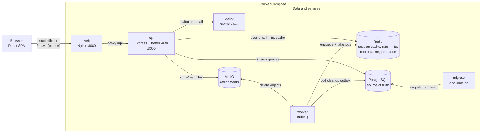

- Nginx serves the SPA and proxies `/api`, so the browser, cookies and API share one origin (no CORS).
- The worker never receives work directly from the API: it polls the `ObjectCleanup` outbox in PostgreSQL and uses a Redis queue for retries, so a Redis outage cannot lose a cleanup.
- `migrate` applies committed Prisma migrations (and demo data locally) before `api` and `worker` start.
- PostgreSQL is authoritative. If Redis is unavailable, cache reads fall back to PostgreSQL and rate limits fall back to per-process memory.

## Request pipeline

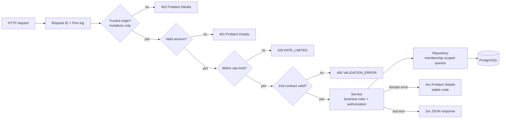

- Route handlers only parse input and map results to HTTP; business rules live in services, queries in repositories.
- Every board query includes the caller's membership, so another board's IDs return `404` rather than leaking existence.
- Errors use RFC 9457 Problem Details with a stable `code` and request ID; stack traces are never returned.

## Code organization

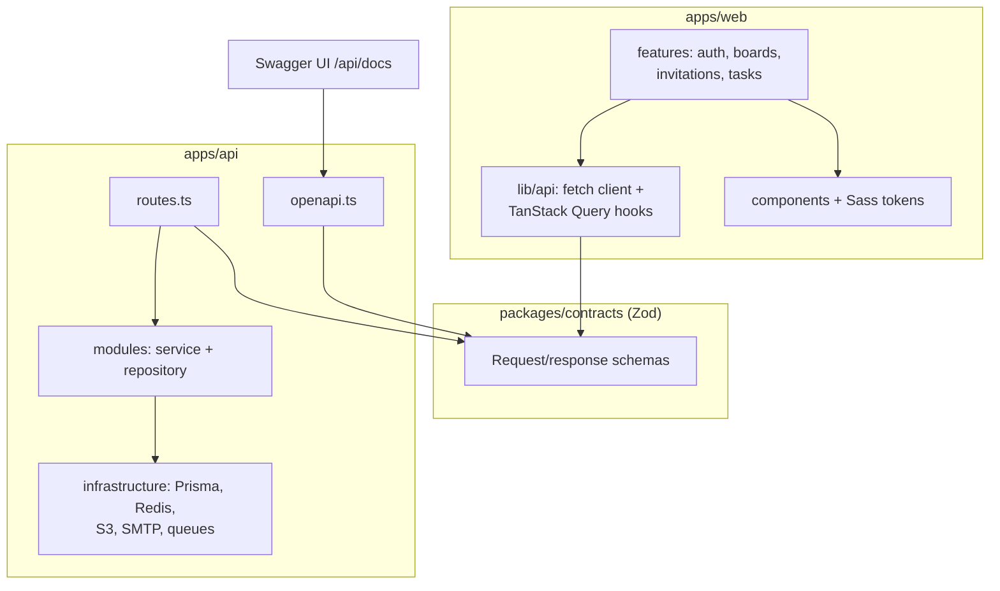

Arrows point to what each part depends on.

- One schema definition drives server validation, client types, client response validation and the OpenAPI document.
- The web app is organized by feature; shared UI moves to `components` only when reused.

## Database

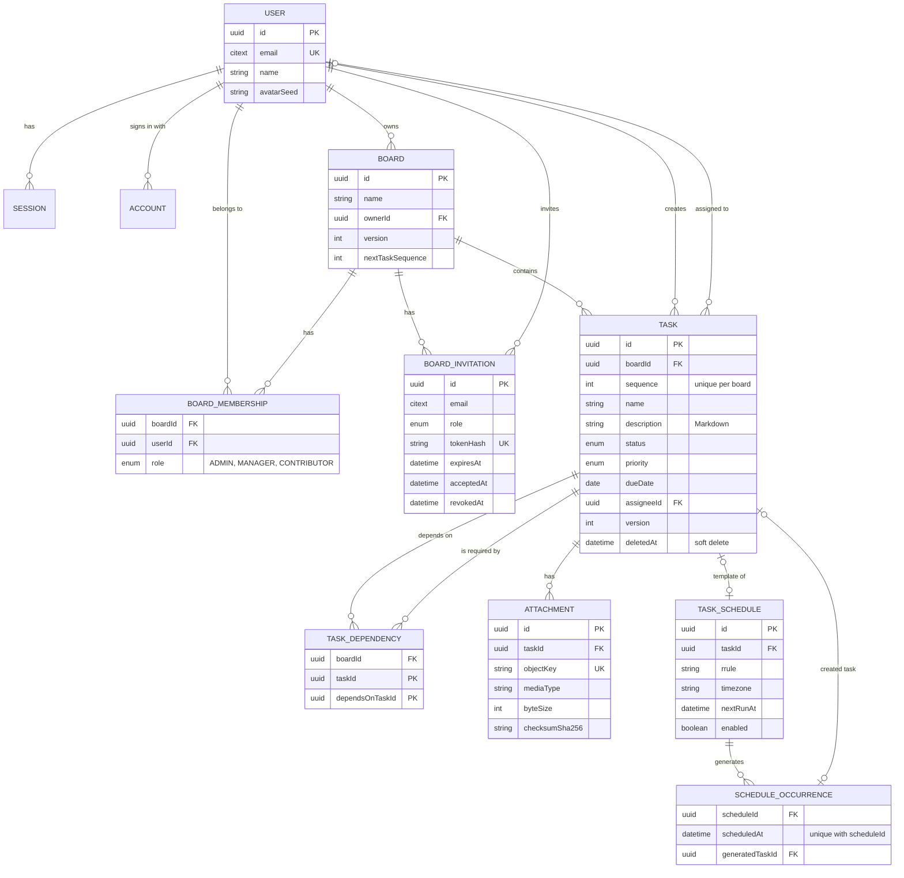

Constraints enforced by PostgreSQL, not only by application code:

- **Same-board rules:** composite foreign keys keep both ends of a dependency on the same board, and require an assignee to be a member of the task's board.
- **Integrity checks:** no self-dependency, non-empty names, description length, unique task number per board, one pending invitation per board and email.
- **Idempotency:** `(scheduleId, scheduledAt)` is unique, so an occurrence can only be created once.
- **Search:** a `pg_trgm` GIN index supports case-insensitive name search; composite indexes cover board, status, assignee and due-date queries.
- Session, account and verification tables are managed by Better Auth; `ObjectCleanup` is an outbox for deleting attachment files.

## Authentication and users

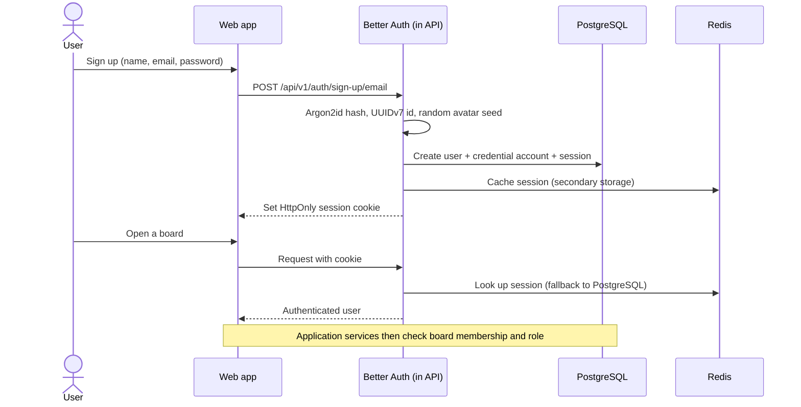

- Sessions are opaque, server-side and revocable; no tokens are stored in `localStorage`.
- Sign-in failures do not reveal whether an email exists; sign-up and sign-in are rate limited.
- Avatars are generated in the browser from the stored seed, with no third-party request.
- **Authentication** (who you are) is handled by Better Auth; **authorization** (what you can do on a board) is handled by application services.

| Role          | Tasks | View members | Invite/cancel members | Invite admins | Edit board |
| ------------- | ----- | ------------ | --------------------- | ------------- | ---------- |
| `ADMIN`       | Yes   | Yes          | Yes                   | Yes           | Yes        |
| `MANAGER`     | Yes   | Yes          | Yes                   | No            | No         |
| `CONTRIBUTOR` | Yes   | Yes          | No                    | No            | No         |

## Board membership and invitations

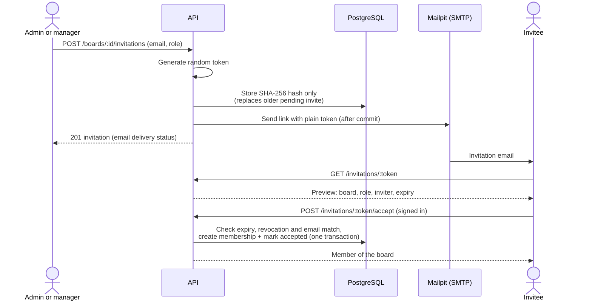

- Plain tokens are never stored or returned by the API.
- Concurrent accepts cannot create duplicate memberships; cancellation and acceptance cannot both succeed.
- If email delivery fails, the invitation stays valid and the API reports `emailDelivery: "FAILED"`.

## Task lifecycle

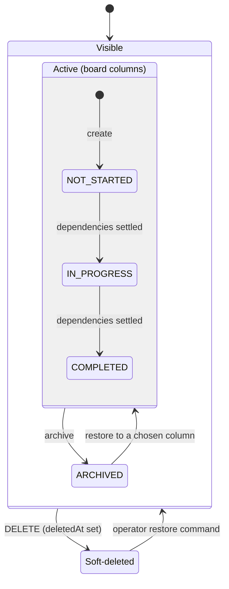

- Arrows show the usual flow; a versioned update can move a task between any statuses, subject to the dependency rule.
- **Dependency rule:** a task cannot move into `IN_PROGRESS` or `COMPLETED` while a prerequisite is `NOT_STARTED` or `IN_PROGRESS`.
- `ARCHIVED` tasks are hidden unless the board's show-archived toggle is on; archiving a recurring template pauses its schedule.
- Deleting sets `deletedAt`: the task disappears from the API (`404`) but its data, dependencies and attachments are kept for recovery.

## Updating a task

Every edit, drag-and-drop move and archive goes through the same versioned update, in one transaction:

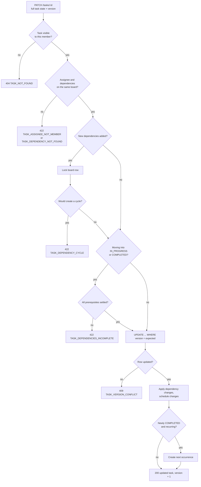

- **Optimistic concurrency:** the update only applies if the stored `version` still matches; otherwise the client reloads the latest task.
- **Cycle safety:** locking the board row serializes dependency changes, so two users cannot each add half of a loop (A→B and B→A) at the same time.
- New tasks get their board number the same way: the board row is locked and `nextTaskSequence` incremented in the insert transaction.

## Recurring tasks

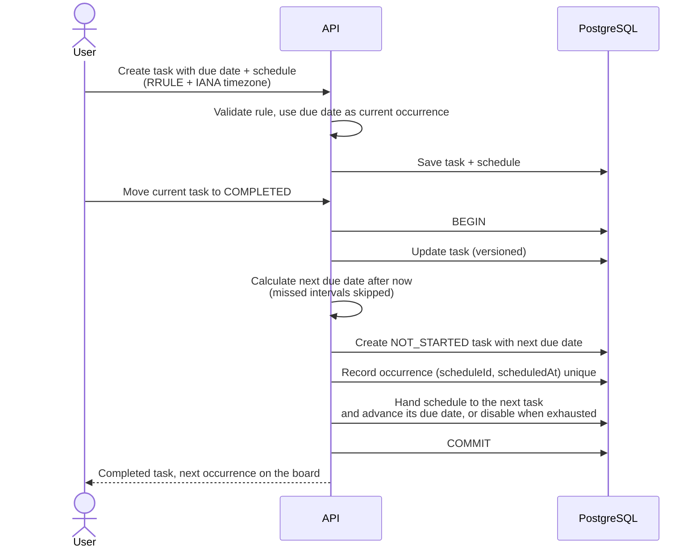

- The schedule is a due-date pattern. Reaching a scheduled date does not create a task; completing the current task creates exactly one next occurrence.
- A recurring task must have a due date, which is the current occurrence's date and the schedule anchor.
- Occurrences are separate tasks: they copy name, description, priority and assignee, but not dependencies or attachments.
- The schedule is handed to the newly generated task in the same transaction. Every current occurrence is therefore marked recurring and can create its successor; deleting an older occurrence, including the original task, does not break the series.
- The unique `(scheduleId, scheduledAt)` record prevents duplicates from retries or concurrent completions.
- Recurrence is evaluated in the chosen timezone, so calendar dates remain stable across daylight-saving changes.
- The **Repeat** menu offers due-date presets and a **Custom…** dialog (interval, weekdays, monthly day or nth weekday, never/on date/after N ends, timezone). Date-derived patterns follow the task when its due date moves. The UI stores RRULEs but never exposes raw RRULE text; the API still validates every rule and rejects unsupported parts.

## Attachments

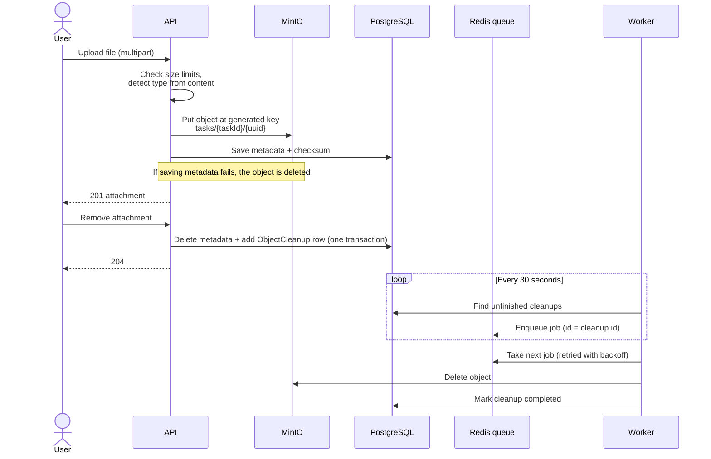

- The bucket is private; files are streamed through the API after a membership check, and object keys are never exposed.
- Allowed types (JPEG, PNG, GIF, WebP, PDF, plain text) are detected from file content, not the browser's declared type. Limits: 10 MiB per file, 50 MiB per task.
- Soft-deleting a task keeps its attachments, so they are restored with it.

## Frontend data flow

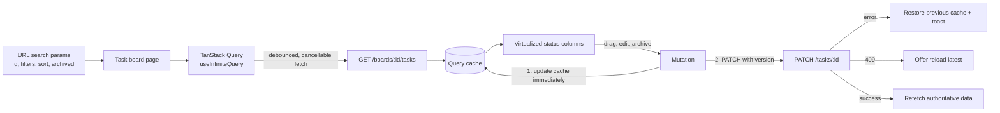

- **State ownership:** server data in TanStack Query, forms in React Hook Form, shareable view state in the URL, and short-lived UI state in components. No global store.
- Every API response is validated against the shared contracts before it reaches components.
- Columns render only visible cards, so boards with 10,000+ tasks stay responsive while pages load on demand.
